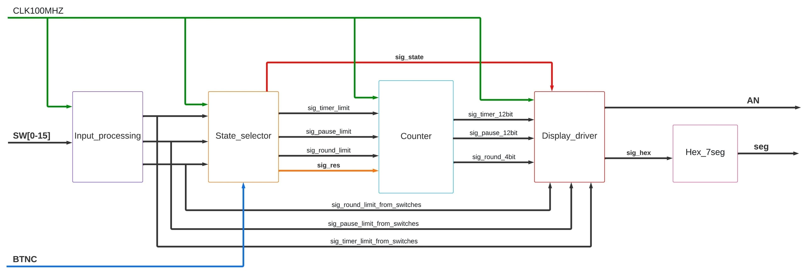

### Team members

* Matěj Baranyk (responsible for coding and correction)
* Vojtěch Javorek (responsible for making README.md and description)
* Gleb Egorov (responsible for coding and diagrams)

## Theoretical description and explanation                                                
A circular workout is a type of training where the exercise is very intense, followed by a short break, and then followed by another intense round. Circular training is usually performed at various stations (for example, 15 stations) that work different parts of the body. The interval of such training is, for example, 45/15 (45 seconds of intense exercise and 15 seconds of rest), but the interval of 30 seconds of exercise and 10-15 seconds of rest is also used. Exercises at the stations are chosen so that each station works a different part of the body. The name "circular" comes from the fact that the individual stations are arranged in a circle. If, for example, the training is done in a gym, it is useful to keep track of the number of completed rounds. Therefore, there are circular workout counters, which we have also created. Our counter can set the number of rounds, round time, and rest time between rounds, and can also reset the entire counter, pause it, and start it.

## Hardware description of demo application                                               
Using switches SW0 - SW3 (maximum 16 rounds), set the number of laps. Switches SW4 - SW9 (maximum 64 minutes) can be used to set the duration of one lap, and switches SW10 - SW15 (maximum 64 minutes) are used to set the length of the break. The entire training session can be started or reset using the BTNC button. The individual seven-segment displays show pairs of numbers from left to right: the number of laps, S for Setup/P for Pause/t for time, the length of the break, and the last pair displays the length of the lap.

Demonstration using pictures:
In the 1st picture we can see the state of the board being set on the 1st round as: 020S 0101, this means:
02 - 2 rounds
0S - setup/settings mode
01 - pause length (in minutes)
01 - round length (in minutes)

Same rules apply here as they did in the previous image, except this time we set the amount of rounds to 14.

## Software description
Source: (project_1/project_1.srcs/sources_1/new/top.vhd)
TestBench: (project_1/project_1.srcs/sim_1/new/tb_top.vhd)

Put flowchats/state diagrams of your algorithm(s)                                         

### Component(s) simulation 											
Write descriptive text and simulation screenshots of your components.

In the picture of simulation we can see how each part of the 7-seg gets lit up. This correlates to the SW settings we've set up in our testbench. 

## Instructions                                                                           

Instructions:
1.Connect the Axys A7-50T board to the PC using the provided microUSB cable.
2.Launch BitStream in the Vivado program.
3.Use the switches (SW0 - SW15) on the board to set the number of rounds, length of each round, and pause time.
4.After setting the switches to the desired positions, configured number of rounds, round length, and rest time will be displayed on the screen.
5.Press the BTNC button (yellow center button) to start the circuit training.
6.You can reset and reconfigure the circuit training using the BTNC button on the board.
7.After resetting, repeat steps 3 to 5.

Photo:

This is the base state that the board should appear in. Without any limits/rounds set.

Video:
[Video link YOUTUBE](https://www.youtube.com/watch?v=pLNbUWPhGSs)

## References                                                                            

1. [Solution of 07-display-driver as done in school - clock_enable.vhd, cnt_up_down.vhd, hex_7seg.vhd](https://github.com/BaranykMatej/digital-electronics-1/tree/main/07-display_driver/display_driver/display_driver.srcs/sources_1/new)

2. [Freshkruhac.cz](https://freshkruhac.cz/kruhovy-trenink/)

3. [Tomas Fryza DE1 git](https://github.com/tomas-fryza/digital-electronics-1)
